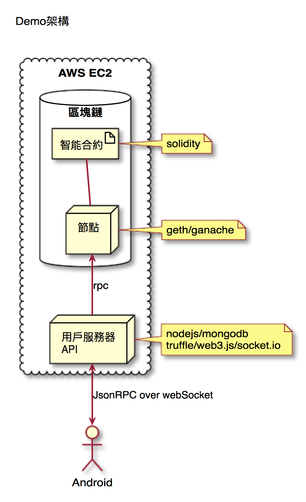

# coinpocket
此程式為區塊鏈智能合約(subcurrency)的Service Gateway

[Android Client](https://github.com/jimliuxyz/coinpocket-android)



# 編譯與佈建合約
```sh
rm -r build/
truffle compile
truffle migrate

truffle migrate --reset
```

# 測試合約 (Mocha testing)
```sh
# test all scripts of ./test
truffle test
```

# 啟動服務
```sh
#1.啟動區塊鏈節點
testrpc ...

#2.佈建智能合約
truffle migrate --reset

#3.啟動mongodb
service mongod start

#4.啟動node執行service gateway
node server/server.js
```

# 環境建立過程紀錄
```sh
npm install -g truffle

# init your folder (folder must be totally empty!)
# or use a ready truffle box (metacoin)
truffle init

```

```sh
# generate package.json for builing evn
npm init
```

```sh
# prepare git

echo node_modules > .gitignore

git init
git add -A
git commit -m "first commit"
git remote add origin https://github.com/jimliuxyz/coinpocket.git
git push -u origin master
```

```sh
# install packages
npm i web3@0.19.0 truffle-contract@3.0.5 mongoose jsonwebtoken ... -S
```

